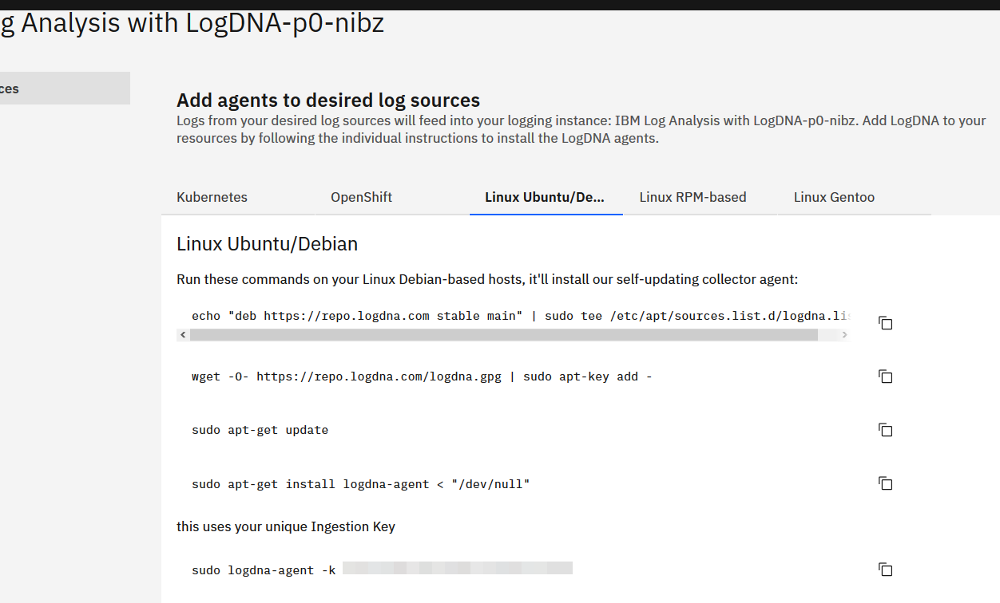

# Real-Time auditing of Kubernetes events with Falco

As Kubernetes becomes the platform of choice for both development and deployment, securing Kubernetes grows from a passing concern to a first class requirement. This document covers *auditing* Kubernetes clusters in real time for activity and building a system to automatically log and process audit events.

Kubernetes is API driven. In many deployments each user, administrator, and developer communicates with the API. When a user issues a `kubectl create deployment` command, that is hitting the API, and the request is logged through the Kubernetes audit system. There are non-human API interactions to log and audit as well, operators work directly against the API with their own set of credentials, and external systems from cloud providers will hit the API as well. All of these interactions should be logged, audited, and processed, with alerts sent out if out-of-compliance behavior is detected.

[Falco](https://falco.org/) is a CNCF security tool that has first-tier support for [Kubernetes audit payloads](https://falco.org/docs/event-sources/kubernetes-audit/) and a rich set of tools for processing those events.

## Prerequisites

* An IBM Cloud Account
* An IBM Cloud Kubernetes Service cluster

## Estimated Time

This can be completed in about half an hour with no issue, faster for people trying to run through it.


Kubernetes can be configured to emit audit events every time the kube api is accessed. We can process these with falco in real time to immediately identify suspicious our malicious behavior. 

1. Create vm from [VPC service](https://cloud.ibm.com/vpc/overview) (gen2)

1. Get the ip of your virtual machine's public floating ip address

```
$ ibmcloud target -r us-east
Switched to region us-east


API endpoint:      https://cloud.ibm.com
Region:            us-east
User:              skrum@us.ibx.com
Account:           Cloud Open Sauce (xxxxxxxxxxxxxxxxxxxxxxxxxxxxxxxx) <-> xxxxxxx
Resource group:    No resource group targeted, use 'ibmcloud target -g RESOURCE_GROUP'
CF API endpoint:
Org:
Space:

$ ibmcloud is instances
Listing instances for generation 2 compute in all resource groups and region us-east under account Cloud Open Source as user skrum@us.ibm.com...
ID                                          Name              Status    Address        Floating IP     Profile    Image
                               VPC       Zone        Resource group
xxxx_xxxxxxxx-xxxx-xxxx-xxxx-xxxxxxxxxxxx   nibz-falco-dev    running   10.241.128.4   52.xxx.xxx.xxx   bx2-8x32   ibm-ubuntu-18-04-1-minimal-amd64-2   nibz      us-east-3   Default

```

If you don't have a floating-ip set, return to the console to set one. It's possible to set one via cli (see `ibmcloud is instance-network-interface-floating-ip-add`, `floating-ip-reserve`, and `instance-network-interface-create`).


1. Pull `ibmcloud-ansible` repo

```git clone https://github.com/nibalizer/ibmcloud-ansible```

1. Run first server configuration script

```./bootstrap_python.sh <ip>```

1. Setup Ansible Inventory file


Replace `192.168.0.10` with the ip or dns name of your server below:

```
[cloud]
192.168.0.10 ansible_ssh_user=ubuntu
```

1. Run first configuration ansible playbook

```
ansible-playbook -i inventory first_config.yaml
```

1. Get `ansible-falco` ansible role

```
git clone https://github.com/juju4/ansible-falco
```

1. Create a playbook file to use the ansible role

Note the `hosts:` field if you changed anything in the inventory file

```
---
- hosts: cloud
  become: yes
  vars:
    falco_grpc_unix_enabled: true
    falco_webserver_enable: true
    #    falco_dev: true
  roles:
    - role: ansible-falco
```

1. Run the ansible playbook to install falco

```
ansible-playbook -i inventory falco-install.yaml
```

1. ssh to host to validate configuration

```
ps -ef | grep falco

tail -f /var/log/falco/falco.log
```

You should see notifications that falco is running but nothing specific to kubernetes.


## Set up kubernetes auditing

IBM Cloud Kubernetes Service (IKS) runs the kubernetes daemons for you. Configuring [kubernetes auditing](https://kubernetes.io/docs/tasks/debug-application-cluster/audit/) requires configuring the kubernetes API serever command-line arguments. IBM Cloud Provides a mechanism to control the audit webhook, and where it points. Read more [here](https://cloud.ibm.com/docs/containers?topic=containers-health#webhook_logdna).

```
ibmcloud ks cluster master audit-webhook set --cluster <cluster_name> --remote-server http://<server_floating_ip>:8765/k8s_audit
ibmcloud ks cluster master audit-webhook get --cluster <cluster_name>

# refresh (takes a few seconds)
ibmcloud ks cluster master refresh --cluster <cluster_name>

```

1. Poke a hole in the firewall/security group for your instance for kube audit events:

```
ibmcloud is security-group-rule-add xxxx-xxxxxxxx-xxxx-xxxx-xxxx-xxxxxxxxxxxx inbound tcp --port-min 8765 --port-max 8765 --output JSON
{
    "direction": "inbound",
    "id": "xxxx-xxxxxxxx-xxxx-xxxx-xxxx-xxxxxxxxxxxx",
    "ip_version": "ipv4",
    "port_max": 8765,
    "port_min": 8765,
    "protocol": "tcp",
    "remote": {
        "cidr_block": "0.0.0.0/0"
    }
}
```

1. That should be it. Check out your logs!

Edit your rules by modifying the k8s rules under ```/etc/falco```

View logs with 

```
tail -f /var/log/falco/falco.log
```


```syslog
Jul 31 21:52:36 nibz-falco-dev falco: 21:52:20.110256128: Warning K8s Operation performed by user not in allowed list of users (user=br3dsptd0mfheg0375g0-admin target=kube-controller-manager/endpoints verb=update uri=/api/v1/namespaces/kube-system/endpoints/kube-controller-manager?timeout=15s resp=200)
Jul 31 21:52:36 nibz-falco-dev falco: 21:52:22.139158016: Warning K8s Operation performed by user not in allowed list of users (user=br3dsptd0mfheg0375g0-controller-manager target=kube-scheduler/endpoints verb=update uri=/api/v1/namespaces/kube-system/endpoints/kube-scheduler?timeout=15s resp=200)
Jul 31 21:52:36 nibz-falco-dev falco: 21:52:23.199183104: Warning K8s Operation performed by user not in allowed list of users (user=br3dsptd0mfheg0375g0-admin target=kube-controller-manager/endpoints verb=update uri=/api/v1/namespaces/kube-system/endpoints/kube-controller-manager?timeout=15s resp=200)
Jul 31 21:52:36 nibz-falco-dev falco: 21:52:25.244869888: Warning K8s Operation performed by user not in allowed list of users (user=br3dsptd0mfheg0375g0-controller-manager target=kube-scheduler/endpoints verb=update uri=/api/v1/namespaces/kube-system/endpoints/kube-scheduler?timeout=15s resp=200)
Jul 31 21:52:36 nibz-falco-dev falco: 21:52:26.293675008: Warning K8s Operation performed by user not in allowed list of users (user=br3dsptd0mfheg0375g0-admin target=kube-controller-manager/endpoints verb=update uri=/api/v1/namespaces/kube-system/endpoints/kube-controller-manager?timeout=15s resp=200)
Jul 31 21:52:36 nibz-falco-dev falco: 21:52:28.339374080: Warning K8s Operation performed by user not in allowed list of users (user=br3dsptd0mfheg0375g0-controller-manager target=kube-scheduler/endpoints verb=update uri=/api/v1/namespaces/kube-system/endpoints/kube-scheduler?timeout=15s resp=200)
Jul 31 21:52:36 nibz-falco-dev falco: 21:52:29.416363008: Warning K8s Operation performed by user not in allowed list of users (user=br3dsptd0mfheg0375g0-admin target=kube-controller-manager/endpoints verb=update uri=/api/v1/namespaces/kube-system/endpoints/kube-controller-manager?timeout=15s resp=200)
Jul 31 21:52:36 nibz-falco-dev falco: 21:52:31.453209088: Warning K8s Operation performed by user not in allowed list of users (user=br3dsptd0mfheg0375g0-controller-manager target=kube-scheduler/endpoints verb=update uri=/api/v1/namespaces/kube-system/endpoints/kube-scheduler?timeout=15s resp=200)
Jul 31 21:52:36 nibz-falco-dev falco: 21:52:35.614809088: Warning K8s Operation performed by user not in allowed list of users (user=br3dsptd0mfheg0375g0-admin target=kube-controller-manager/endpoints verb=update uri=/api/v1/namespaces/kube-system/endpoints/kube-controller-manager?timeout=15s resp=200)
Jul 31 21:53:03 nibz-falco-dev falco: 21:52:36.556668928: Warning K8s Operation performed by user not in allowed list of users (user=br3dsptd0mfheg0375g0-admin target=cloud-controller-manager/endpoints verb=update uri=/api/v1/namespaces/kube-system/endpoints/cloud-controller-manager resp=200)
Jul 31 21:53:03 nibz-falco-dev falco: 21:52:39.623470080: Warning K8s Operation performed by user not in allowed list of users (user=br3dsptd0mfheg0375g0-admin target=cloud-controller-manager/endpoints verb=update uri=/api/v1/namespaces/kube-system/endpoints/cloud-controller-manager resp=200)
Jul 31 21:53:03 nibz-falco-dev falco: 21:52:42.690744064: Warning K8s Operation performed by user not in allowed list of users (user=br3dsptd0mfheg0375g0-admin target=cloud-controller-manager/endpoints verb=update uri=/api/v1/namespaces/kube-system/endpoints/cloud-controller-manager resp=200)
Jul 31 21:53:03 nibz-falco-dev falco: 21:52:45.761656064: Warning K8s Operation performed by user not in allowed list of users (user=br3dsptd0mfheg0375g0-admin target=cloud-controller-manager/endpoints verb=update uri=/api/v1/namespaces/kube-system/endpoints/cloud-controller-manager resp=200)
Jul 31 21:53:03 nibz-falco-dev falco: 21:52:48.833193984: Warning K8s Operation performed by user not in allowed list of users (user=br3dsptd0mfheg0375g0-admin target=cloud-controller-manager/endpoints verb=update uri=/api/v1/namespaces/kube-system/endpoints/cloud-controller-manager resp=200)
Jul 31 21:53:03 nibz-falco-dev falco: 21:52:51.915211008: Warning K8s Operation performed by user not in allowed list of users (user=br3dsptd0mfheg0375g0-admin target=cloud-controller-manager/endpoints verb=update uri=/api/v1/namespaces/kube-system/endpoints/cloud-controller-manager resp=200)
Jul 31 21:53:03 nibz-falco-dev falco: 21:52:55.004199936: Warning K8s Operation performed by user not in allowed list of users (user=br3dsptd0mfheg0375g0-admin target=cloud-controller-manager/endpoints verb=update uri=/api/v1/namespaces/kube-system/endpoints/cloud-controller-manager resp=200)
Jul 31 21:53:03 nibz-falco-dev falco: 21:52:58.079348992: Warning K8s Operation performed by user not in allowed list of users (user=br3dsptd0mfheg0375g0-admin target=cloud-controller-manager/endpoints verb=update uri=/api/v1/namespaces/kube-system/endpoints/cloud-controller-manager resp=200)
Jul 31 21:53:03 nibz-falco-dev falco: 21:53:01.160041984: Warning K8s Operation performed by user not in allowed list of users (user=br3dsptd0mfheg0375g0-admin target=cloud-controller-manager/endpoints verb=update uri=/api/v1/namespaces/kube-system/endpoints/cloud-controller-manager resp=200)
```


# Set up forwarding of events from falco into logdna

Now set up [Log analysis on IBM Cloud with Log DNA](https://www.ibm.com/cloud/log-analysis). You'll want at least 30 days of retention for this example.


Navigate to "Edit Log Sources"


Then find your LogDNA API Key and Log host. The easiest way to do this is to select the "Linux Ubuntu/Debian" panel and copy/paste out the key and host. Note that the API Host and Log Host are different. We only need Log host for this exercise.



```bash
# modify the below if your log host is not in us-south
export LOGDNA_URL="https://logs.us-south.logging.cloud.ibm.com/logs/ingest"
export LOGDNA_KEY="eb250a1fedd547d6ae0a"
```

Now pull down the Falco -> LogDNA exporter script

```
git clone https://github.com/falcosecurity/evolution
cp -r evolution/integrations/logdna/ .
virtualenv --python=python3 venv
source venv/bin/activate
pip install -r requirements.txt
```

In most cases you'll have to relax permissions on the falco unix socket. You can also use a unix group if `777` is too insecure for you.

```
sudo chmod 777 /var/run/falco.sock
```

Now you can run the `falco-logdna` exporter

```
python falco-logdna.py --logdna-key ${LOGDNA_KEY} --logdna-url ${LOGDNA_URL}
```


In the LogDNA UI you should see kubernetes security events.


## Conclusion

In this tutorial we've done the following:

* Configured IBM Kubernetes Service to transmit audit logs to our service
* Set up a VM on IBM Cloud VPC with proper config/networking
* Set up falco to receive audit payloads from Kubernetes
* Configured Falco to store those logs for further analysis in LogDNA

What is next:

* Write or configure a [falco rule](https://falco.org/docs/event-sources/kubernetes-audit/) to pick out a specific security incident
* Configure falco to use chatops to alert admins of a security [incident](https://github.com/falcosecurity/falcosidekick/)
* Read more about [falco for auditing on IBM Cloud](https://developer.ibm.com/technologies/containers/tutorials/installing-and-using-sysdig-falco/)
* Run Falco [inside Kubernetes](https://github.com/falcosecurity/charts/tree/master/falco) if you don't prefer to run it on a separate VM host


